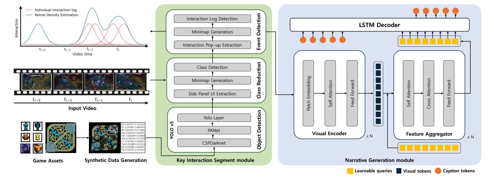
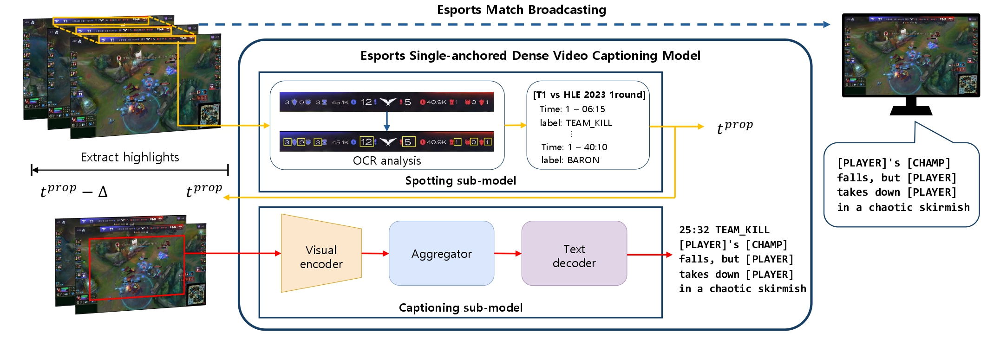
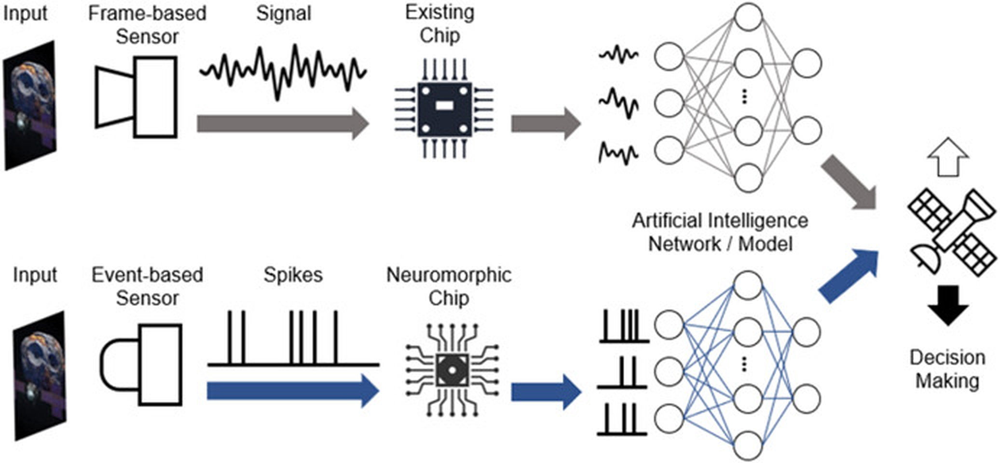
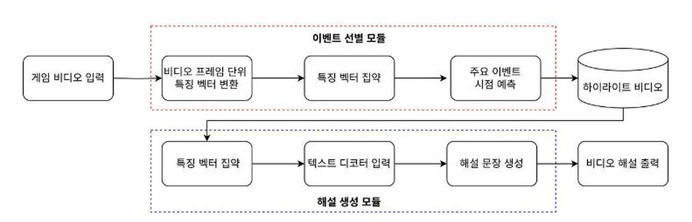
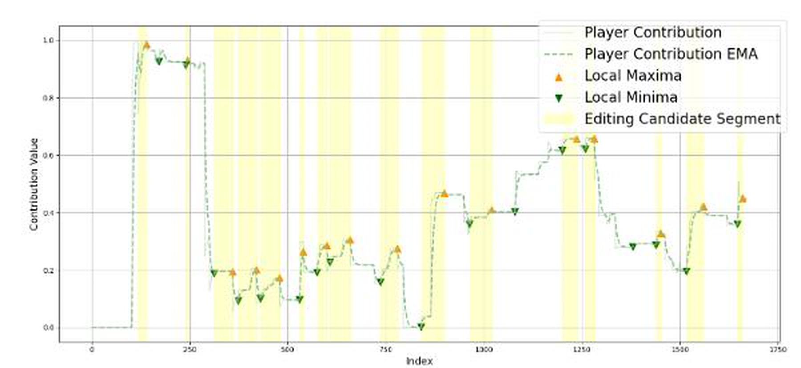








# About Me
I am an M.S. student at UST-ETRI and a student researcher in the Immersive Interaction Research Laboratory at [ETRI](https://www.etri.re.kr/kor/main/main.etri) (Electronics and Telecommunications Research Institute), led by Prof. Sang Kwang Lee.
 
My research interests include computer vision and multimodal data processing.
 
 

# News
- *2025*, Featured in UST Story: [Development of generative AI-based E-sports service automation platform technology](https://blog.naver.com/uststory/224163085962?trackingCode=rss)
 
 

# Educations
- *2024.03 - (now)*, M.S. in Artificial Intelligence, University of Science and Technology.
- *2018.03 - 2023.02*, B.A. in Arts, Double Major in Economics, Hankuk University of Foreign Studies.
 
 

# Work Experience
- *2024.03 - (now)*, Student Researcher, Immersive Interaction Research Lab, ETRI.
 
 

# Publications

## International

NeurIPS 2025 Workshop

[Interaction-Aware Video Narrative Generation for Short-Form Gaming Content](https://neurips.cc/virtual/2025/loc/san-diego/131799)

**Ari Yu**, Sung-Yun Park, and Sang-Kwang Lee

NeurIPS 2025 NextVid Workshop (Poster)

[**Paper**](https://neurips.cc/virtual/2025/loc/san-diego/131799), [**Project**](https://github.com/code-lab78/IaVNG-interaction-log-detection)

ACM MMSports 2025

[Single-anchored Multi-modal Dense Video Captioning for Esports Broadcasts Commentaries](https://dl.acm.org/doi/10.1145/3728423.3759412)

**Ari Yu**, Jinwoo Hyun, Hyeong-Gyu Jang, Sung-Yun Park, and Sang-Kwang Lee

ACM MMSports 2025 (Oral)

[**Paper**](https://dl.acm.org/doi/10.1145/3728423.3759412)

EAAI 2025

[Toward transforming space exploration with artificial intelligence neuromorphic computing](https://www.sciencedirect.com/science/article/pii/S0952197625010565)

**Ari Yu**, Seungwan Woo, and Hyojung Ahn

Engineering Applications of Artificial Intelligence, 154, 111055. (IF 8.0)

[**Paper**](https://www.sciencedirect.com/science/article/pii/S0952197625010565)

## Domestic

IEIE 2025

[Multimodal Dense Video Captioning for MOBA Game Highlights Commentaries](https://www.dbpia.co.kr/pdf/pdfView.do?nodeId=NODE12331973)

**Ari Yu**, Hyeong-Gyu Jang, and Sang-Kwang Lee

IEIE 2025 (Poster)

[**Paper**](https://www.dbpia.co.kr/pdf/pdfView.do?nodeId=NODE12331973)

IEIE 2025

[A Short-form Content Generation Scheme for MOBA Games](https://www.dbpia.co.kr/pdf/pdfView.do?nodeId=NODE12332321)

Hyeong-Gyu Jang, **Ari Yu**, and Sang-Kwang Lee 

IEIE 2025 (Poster)

[**Paper**](https://www.dbpia.co.kr/pdf/pdfView.do?nodeId=NODE12332321)

 

# Patents

## International
- Method And Apparatus for Generating E-Sports Match Highlight Commentary Based on Multimodal Video Captioning (U.S.A.) - Pending

## Domestic
- Method And Apparatus for Generating E-Sports Match Highlight Commentary Based on Multimodal Video Captioning, Application 

No. 10-2025-0157168

 
 

# Technology Transfer
- Generative AI-based eSports service automation technology
 
 

# Software Registration
- Narration Generation Software for Esports Game Videos
 
 

# Projects
- *2024.07 - 2026.12*, Development of generative AI-based E-sports service automation platform technology to improve E-sports operation efficiency.
 
 

# Honors and Awards
- *2025*, National Strategic Technology Excellence Scholarship.
- *2021*, Grand Prize, Hankuk University of Foreign Studies 4th Company Analysis Creative Proposal Contest.
  - Presented KOICA's strategy to build a platform for development cooperation in the Vietnamese film industry.
- *2019*, Grand Prize, Hankuk University of Foreign Studies 6th Better World Idea Workshop.
  - Presented an idea for a generation convergence radio under the theme of "Convergence of Culture and Science and Technology."
